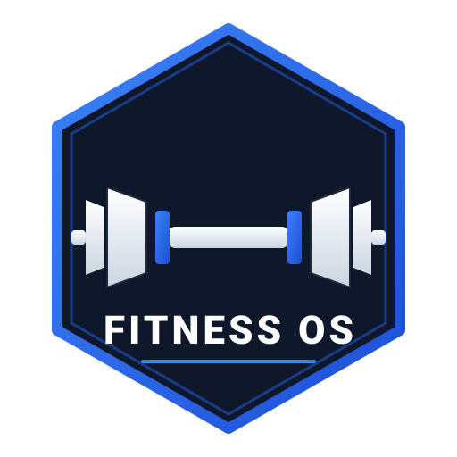

<p align="center">
  
</p>

<h1 align="center">⚡ Fitness OS</h1>

<p align="center">
  <b>Phone-First Precision Health & OpenGym Engine</b><br />
  <i>A mobile-first, privacy-focused fitness operating system built for accurate calorie budgeting, OpenGym workout routines, 7-day weight analytics, and AI coaching.</i>
</p>

<p align="center">
  <a href="#-key-features">Key Features</a> •
  <a href="#%EF%B8%8F-tech-stack">Tech Stack</a> •
  <a href="#-scientific-formulas">Math & Formulas</a> •
  <a href="#-getting-started">Getting Started</a> •
  <a href="#-deployment">Deployment</a>
</p>

<p align="center">
  
  
  
  
  
</p>

---

## 🌟 Key Features

### 📱 1. Phone-First Mobile Ergonomics
- **Native Bottom Navigation Bar**: Anchored, thumb-friendly navigation tabs for **Plan**, **Workouts**, **Progress**, and **AI Coach**.
- **Progressive Web App (PWA)**: Built-in Web App Manifest supporting full-screen standalone installation on iOS and Android.
- **High-Density Mobile UI**: Clean, restrained aesthetic built without unnecessary visual clutter or bloated animations.

### 🎯 2. Directional Calorie & Goal Math
- **7,700 kcal/kg Fat Loss Standard**: Enforces a caloric deficit whenever target weight is lower than current weight ($7,700 \text{ kcal}$ per kg of body fat loss).
- **Muscle Preservation Protocol**: Allocates protein at $2.2 \text{ g/kg}$ of body weight to retain lean muscle tissue during weight loss.
- **Consumer Terminology**: Clear English labels (**Resting Calories**, **Daily Energy Burn**, **Calorie Budget**, **Fat Loss Pace**).
- **Diet vs. Exercise Split**: Custom ratio slider to balance caloric reduction between food intake and physical exercise.

### 🏋️ 3. OpenGym Workout Logger
- **Pre-loaded Training Splits**: Includes Push/Pull/Legs (PPL), Upper/Lower, and Full Body routines.
- **Set & Rep Logger**: Track completed sets, target weights, and exercise execution notes.
- **Built-in Rest Timer**: Integrated 60s and 90s interval timers with audio/visual feedback.

### 📈 4. Weight Trend Analytics
- **Daily Entry Tracker**: Record daily weigh-ins stored directly on device.
- **7-Day Rolling Averages**: Smooths out daily water weight fluctuations to compute true progress states (*On Track*, *Slower Than Planned*, *Faster Than Planned*).

### 🤖 5. Dual-Engine AI Coach
- **OpenAI Integration**: Directly streams tailored guidance via `gpt-4o-mini` when an `OPENAI_API_KEY` is provided.
- **Offline Fallback Engine**: Operates 100% offline without API keys, providing 5 structured recommendations across Nutrition, Training, Hydration, Recovery, and Mindset.

### 👤 6. Client-Side Multi-User Profiles
- **Multi-Profile Isolation**: Create and switch between isolated local profiles (e.g. *Personal*, *Partner*, *Guest*).
- **PIN Privacy Lock**: Optional 4-digit PIN protection for profile data.
- **100% Privacy & Zero Server Cost**: All data persists in browser `localStorage` with zero database or API server overhead.

---

## 🛠️ Tech Stack

| Domain | Technology |
| :--- | :--- |
| **Framework** | Next.js 16 (App Router, Turbopack) |
| **Language** | TypeScript 5 (Strict Type Checking) |
| **Styling** | Tailwind CSS v4 + Lucide Icons |
| **PWA Support** | Web App Manifest + iOS Standalone Meta Tags |
| **State & Storage** | Device `localStorage` (User-partitioned) |
| **AI Integration** | OpenAI API (`gpt-4o-mini`) + Offline Rule Engine |
| **Deployment** | Vercel (Static / Serverless Edge) |

---

## 📐 Scientific Formulas

### Resting Calories (BMR - Mifflin-St Jeor)
$$BMR_{\text{male}} = 10 \times \text{Weight (kg)} + 6.25 \times \text{Height (cm)} - 5 \times \text{Age} + 5$$
$$BMR_{\text{female}} = 10 \times \text{Weight (kg)} + 6.25 \times \text{Height (cm)} - 5 \times \text{Age} - 161$$

### Daily Energy Burn (TDEE)
$$TDEE = BMR \times \text{Activity Multiplier } (1.2 \times \text{ to } 1.9 \times)$$

### Target Journey Deficit
$$\text{Total Deficit (kcal)} = (\text{Current Weight} - \text{Target Weight}) \times 7,700 \text{ kcal}$$

---

## 🚀 Getting Started

### Prerequisites
- Node.js 18.x or higher
- npm 9.x or higher

### Installation & Local Setup

1. **Clone the repository**:
   ```bash
   git clone https://github.com/shreshthdubeyy/Fitness-App.git
   cd Fitness-App
   ```

2. **Install dependencies**:
   ```bash
   npm install
   ```

3. **Run the development server**:
   ```bash
   npm run dev
   ```

4. **Open in Browser**:
   Navigate to `http://localhost:3000` to interact with the application.

---

## 🌐 Deployment

### Deploy to Vercel (1-Click Hosting)

1. Push your repository to GitHub.
2. Log into [Vercel.com](https://vercel.com) with your GitHub account.
3. Select **Add New → Project** and import `Fitness-App`.
4. *(Optional)* Add an Environment Variable named `OPENAI_API_KEY` for live AI chat completions.
5. Click **Deploy**. Vercel will automatically build and publish your application.

---

## 📄 License

Distributed under the **MIT License**. See `LICENSE` for details.
