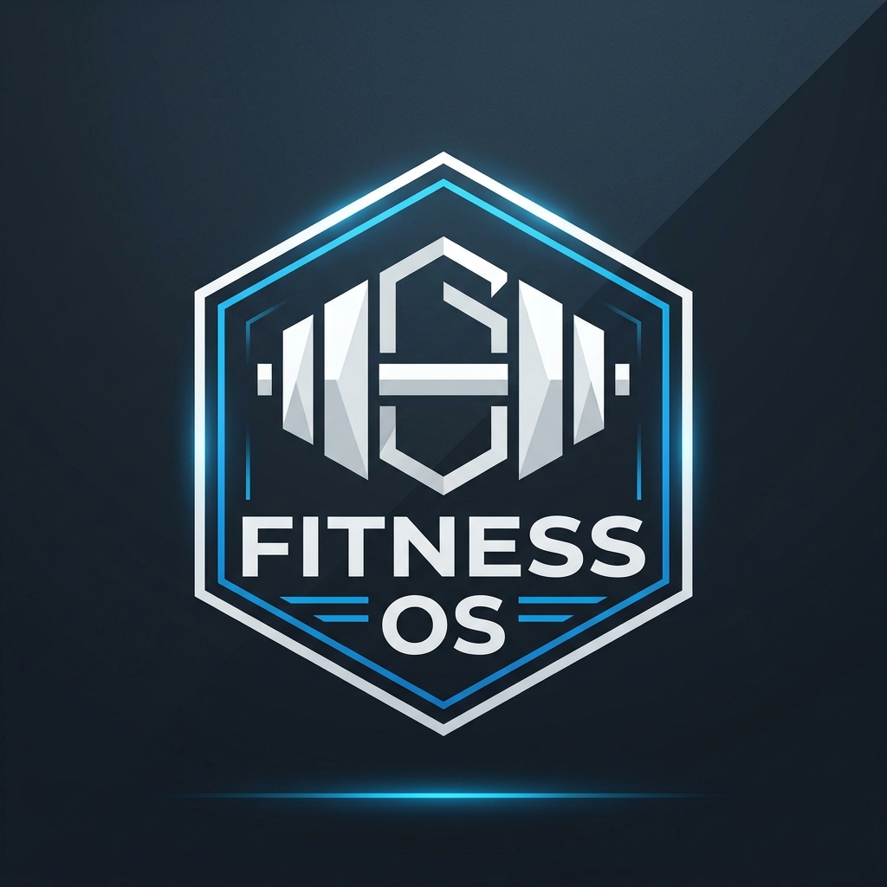

# ⚡ Fitness OS — Phone-First Precision Health & OpenGym Engine

<p align="center">
  
</p>

> A mobile-first, privacy-focused fitness operating system built with Next.js 16, TypeScript, Tailwind CSS, and OpenGym workouts. Features precision calorie budgeting, 7,700 kcal fat loss math, multi-user local storage, and AI coaching.


---

## 🌟 Key Features

### 📱 1. Phone-First Mobile Architecture
- **Native Bottom Navigation Bar**: Anchored thumb-friendly tabs for 🏠 **Plan**, 🏋️ **Workouts**, 📈 **Progress**, and 🤖 **AI Coach**.
- **Progressive Web App (PWA)**: Open on Safari or Chrome and tap **"Add to Home Screen"** to install as a full-screen mobile app icon without browser bars.
- **One-Handed Ergonomics**: Large tap targets (44px+) designed specifically for iOS and Android viewports.

### 🎯 2. Precision Energy & Calorie Engine
- **Directional Goal Logic**: Correctly calculates a **Caloric Deficit** whenever target weight is lower than current weight ($7,700\text{ kcal/kg}$ energy math), while keeping protein high ($2.2\text{ g/kg}$) for muscle preservation.
- **Consumer Readability**: Plain English terminology (**Resting Calories**, **Daily Energy Burn**, **Calorie Budget**, **Fat Loss Pace**).
- **Diet vs. Activity Split**: Configurable slider allocating deficit between diet reduction and active exercise.
- **Safety Guardrails**: Rate-of-loss warning if target weekly loss exceeds $1.0\text{--}1.2\%$ body weight/week.

### 🏋️ 3. OpenGym Workout Integration
- **Structured Routines**: Push / Pull / Legs (PPL), Upper / Lower Split, and Full Body Recomp.
- **Interactive Set Logger**: Log sets, reps, and target weights with set completion checkboxes.
- **Built-in Rest Timer**: Automated 60s / 90s countdown rest timer.

### 📈 4. Weight Progress & 7-Day Trend Analytics
- **Daily Weight Log**: Log daily weight entries stored locally.
- **7-Day Rolling Averages**: Evaluates progress states (*On Track*, *Slower Than Planned*, *Faster Than Planned*) to ignore single-day weight fluctuations.

### 🤖 5. Dual-Engine AI Fitness Coach
- **OpenAI Integration**: Calls `gpt-4o-mini` via `POST /api/recommendations` when `OPENAI_API_KEY` is present.
- **Smart Fallback Generator**: Works 100% offline without API keys, producing 5 structured recommendations across Nutrition, Training, Hydration, Recovery, and Mindset.

### 👤 6. Client-Side Multi-User Profiles
- **Multi-User Profile Switching**: Multiple users on the same phone/browser can create isolated profiles (e.g. *Shreshth*, *Alex*, *Sarah*).
- **Optional PIN Authentication**: 4-digit PIN lock for profile privacy.
- **100% Private & Free**: All data stays on device `localStorage`—zero cloud database costs!

---

## 🛠️ Tech Stack

| Layer | Technology |
| :--- | :--- |
| **Framework** | Next.js 16 (App Router, Turbopack) |
| **Language** | TypeScript 5 (Strict Mode, 0 `any` types) |
| **Styling** | Tailwind CSS v4 + Lucide Icons |
| **PWA** | Web App Manifest + iOS Standalone Meta |
| **Storage** | Device `localStorage` (User-partitioned) |
| **Deployment** | Vercel (100% Free Tier Compatible) |

---

## 📐 Scientific Formulas & Heuristics

```text
Resting Calories (BMR - Mifflin-St Jeor):
  Male = 10W + 6.25H - 5A + 5
  Female = 10W + 6.25H - 5A - 161

Daily Energy Burn (TDEE):
  TDEE = BMR × Activity Multiplier (1.2x – 1.9x)

Fat Loss Energy Deficit:
  Total Journey Deficit = (Current Weight - Target Weight) × 7,700 kcal

Hydration Target:
  Baseline Water = Body Weight (kg) × 35 ml
```

---

## 🚀 Quick Start (Local Development)

```bash
# 1. Clone the repository
git clone https://github.com/shreshthdubeyy/Fitness-App.git

# 2. Navigate to directory
cd Fitness-App

# 3. Install dependencies
npm install

# 4. Start local development server
npm run dev
```

Open **[http://localhost:3000](http://localhost:3000)** in your browser!

---

## 🌐 Deploy to Vercel (100% Free Forever)

1. Push your repository to **GitHub**.
2. Sign in to **[Vercel.com](https://vercel.com)** with your GitHub account.
3. Click **"Add New" → "Project"** and select `shreshthdubeyy/Fitness-App`.
4. *(Optional)* Add Environment Variable `OPENAI_API_KEY` for live AI chat completions.
5. Click **Deploy**. Your app will be live in ~60 seconds!

---

## 📄 License

Distributed under the **MIT License**. See `LICENSE` for details.
